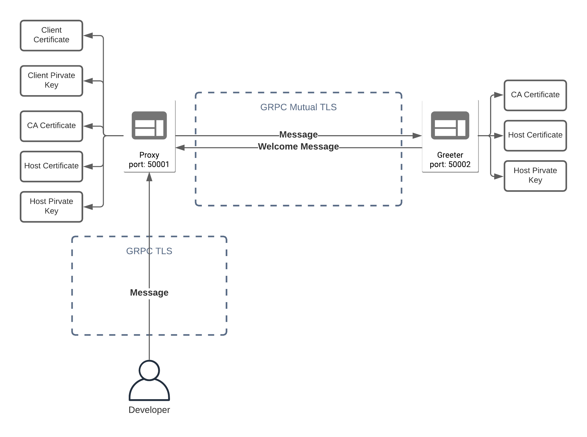

### Prerequisite
- Please make sure you installed Go 1.15+
- Please make sure you installed grpcurl
- Please make sure that you trust the root ca `calvin.zendesk.com.crt`

### Start GRPC servers
- Run `make`
- Run `./bin/proxy` to start proxy GRPC server
- Run `./bin/greeter` to start greeter GRPC server

### Verify Go GRPC MTLS
Request
```
grpcurl -import-path <protobuf_path> -proto proxy.proto -d @ localhost:50001 protobuf.Proxy/Forward <<EOM
{
  "message": "John"
}
EOM
```

Response
```
{
  "message": "Welcome John"
}
```

### Component Diagram

